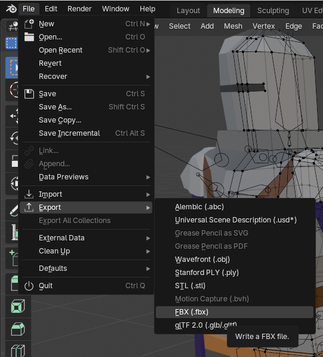
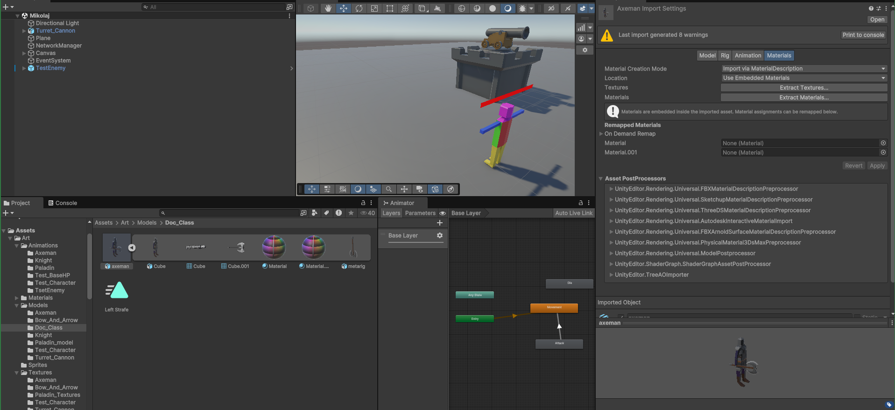

# Tworzenie nowej klasy postaci
By *Mikołaj*

- [1. Utworzenie modelu postaci](#1-utworzenie-modelu-postaci)
- [2. Rigging](#2-rigging)
- [3. Export do FBX](#3-export-do-fbx)
- [4. Generowanie animacji](#4-generowanie-animacji)
- [5. Import zanimowanego modelu do Unity](#5-import-zanimowanego-modelu-do-unity)
- [6. Utworzenie Prefabu i skryptów](#6-utworzenie-prefabu-i-skryptów)
- [7. Utworzenie brakujących skryptów dla nowej klasy](#7-utworzenie-brakujących-skryptów-dla-nowej-klasy)
- [8. Dodanie animacji poruszania się](#8-dodanie-animacji-poruszania-się)
- [9. Zapisanie prefabu](#9-zapisanie-prefabu)
- [10. Dodawanie nowej klasy do player spawnera](#10-dodawanie-nowej-klasy-do-player-spawnera)
- [11. Testowanie](#11-testowanie)
- [FAQ](#faq)

> **Important**: O czym jest ten dokument
> 
> W tym dokumencie są instrukcje jak dodać nową klasę postaci **Doc_class**. Wykorzystam w niej model gotowej klasy **Axeman**.

## 1. Utworzenie modelu postaci
Uruchamiamy blender. [Tutaj jest dobry materiał na YT jak zacząć](https://www.youtube.com/watch?v=O6HQhs-gk50). Wystarczy obejrzeć:
1. **0.00-9.24** (tworzenie postaci low-poly)
2. **40.00-46.00** (kolorowanie)
Ten proces można pominąć, jeżeli mamy już gotowy model np. ze [sketchfab](https://sketchfab.com/). Ja osobiście stamtąd nie biorę całych modeli, bo najczęściej nie pasują stylistycznie do gry lub nie chcą się poprawnie importować do blendera / Unity. Ale pobrałem stamtąd np. miecz i tarczę postaci **Knight**.
Poniżej gotowy model klasy **Axeman**.


Istotne jest, żeby nasz model przypadkiem nie miał zdublowanych węzłów. Objawia się to warningiem w Unity:


Jak się tego pozbyć w pierwszym miejscu:
1. Jesteśmy w `edit mode`
2. Zaznaczamy wszystkie węzły klawiszem `a`
3. `Merge Vertices` -> `By distance`


## 2. Rigging
Mamy surowy model, trzeba dodać do niego szkielet który będzie poruszał odpowiednimi węzłami. Używamy do tego plugin *Rigify*, wbudowany w blender. Posiada od razu podstawowy szkielet człowieka. 
[Tu jest niezły poradnik](https://www.youtube.com/watch?v=m-Obo_nC3SM). Oglądamy do **7.31**.
[Tutaj jest jak poprawić automatycznie wygenerowany szkielet](https://www.youtube.com/watch?v=4fICQmBEt4Y). Trzeba będzie to zrobić m.in. w sytuacji, kiedy [nasze wygenerowane animacje](#4-generowanie-animacji) będą *dziwne*.
Warto spróbować ułożyć jakieś konkretne pozy, np. biegania żeby sprawdzić, czy poruszenie prawą ręką nie obróci lewej stopy itd.


- [Nie mogę włączyć *Pose mode* w blender](#nie-mogę-włączyć-pose-mode-w-blender)
- [Nie mogę włączyć *Weight paint* w blender](#nie-mogę-włączyć-weight-paint-w-blender)
- [Nie mogę wybrać konkretnej kości w *Weight paint*](#nie-mogę-wybrać-konkretnej-kości-w-weight-paint)
- [Malowanie w trybie *Weight paint* nic nie zmienia](#malowanie-w-trybie-weight-paint-nic-nie-zmienia)
- [Jak dodać przedmiot do zriggowanego modelu?](#jak-dodać-przedmiot-do-zriggowanego-modelu)

## 3. Export do FBX
Unity nie obsługuje formatów blenderowych. Cały nasz model z teksturami i szkieletem należy wyeksportować do **FBX**. To jest taki zip, który zawiera wszystko.
1. Na górze `File -> Export -> FBX`
2. Po prawej stronie zaznaczamy `Path Mode: Copy` oraz `Embedded textures`




- [Mój model nie ma tekstur w Mixamo (jest szary)](#mój-model-nie-ma-tekstur-w-mixamo-jest-szary)

## 4. Generowanie animacji
### Mixamo
https://www.mixamo.com/ - tutaj dla naszego **FBX** można automatycznie wygenerować animacje. Mixamo ma swój własny rigger, ale jest beznadziejny. Poza tym my już szkielet i tak mamy gotowy.

Animacji do wyboru jest dużo, są dosyć typowe np. poruszanie się postaci, atakowanie wręcz itd.
Potrzebne na pewno będą będą:
- Poruszanie się WASD
- Atak
- Śmierć

Na górze jest wyszukiwarka.
Po prawej stronie można dostosować parametry np. Długość ramienia naszej postaci.
Pobieramy każdą animację jako osobny plik **FBX**. Później [będziemy wyjmować z niego tylko animację](#5-import-zanimowanego-modelu-do-unity). Co do ruchu lewo/prawo to polecam animacje **strafe left / right**.
Pobieramy 60fps, with skin (chociaż to akurat chyba nie ma znaczenia).

> **Note**
> 
> Zawsze robiłem `Format: FBX Binary`. Jest też `FBX for Unity`, nigdy tego nie testowałem. Być może oszczędzi to problemów w [Import zanimowanego modelu do Unity](#5-import-zanimowanego-modelu-do-unity).


- [Mój model w mixamo ma dziwne animacje](#mój-model-w-mixamo-ma-dziwne-animacje)

### Ręcznie
Animacje nietypowe trzeba zrobić samodzielnie.
_todo_

## 5. Import zanimowanego modelu do Unity
### **FBX** oraz animacje
Tworzymy folder w `Assets/Art/Models/[nazwa-klasy]`.
Kopiujemy tam plik **FBX** który wegenerował nam Blender. Oprócz tego wrzucamy tam też pliki **FBX** które mamy z [mixamo](#mixamo).


**FBX** od mixamo ma wszystko zdublowane (model, tekstury itp.), nam zależy tylko na animacji *mixamo.com*. 
1. Zaznaczamy animację *mixamo.com*
2. wciskamy `Ctrl+D` żeby utworzyć kopię już poza **FBX**
3. zamieniamy nazwę na bardziej przyjazną
4. usuwamy niepotrzebny plik od mixamo.


Animacje można już teraz przenieść do folderu `Art/Animations/[nazwa-klasy]`.
### Materiały i tekstury
1. Klikamy na **FBX**
2. Wybieramy *Materials*
3. Eksportujemy tekstury i materiały
4. Przenosimy do odpowiednich folderów




- [Mój model w Unity jest różowy](#mój-model-w-unity-jest-różowy)

## 6. Utworzenie Prefabu i skryptów
Przeciągamy nasz plik **FBX** do sceny. Okazuje się, że brakuje w nim jeszcze wielu elementów.
### Dodanie brakujących elementów Prefabu
Poniżej **Axeman** to gotowy prefab, a **doc_class** to świeżo dodany **FBX**.


Żeby dodać element do prefabu, to klikamy na niego prawym, potem `Create empty`.
Możemy sobie uprościć robotę. Kopiujemy wszystkie elementy których nam brakuje do naszego **FBX**.


Są to głównie Hud oraz zmienne geometryczne.
Należy dostosować pozycję `HeadCheck` i `CameraHolder` do naszego modelu.
### Dodanie brakujących skryptów Prefabu
Należy dodać wszystkie skrypty zaznaczone ptaszkiem, oraz `Rigidbody`.


Przy konfiguracji tych skryptów z poziomu Unity proszę wzorować się na klasie **Axeman**. Tutaj chodzi m.in. o statystyki HP, DMG, prędkość ruchu itd. `Capsule Collider` to nasz hitbox, należy go ustawić zgodnie z naszym modelem.

## 7. Utworzenie brakujących skryptów dla nowej klasy
### Class script
Używany m.in. do prawidłowego spawnowania klasy. Po prostu nadpisywanie zmiennych
```cs
using UnityEngine;

public class AxemanClass : PlayerClass
{
    public AxemanClass()
    {
        className = "Axeman";
        attackRange = 3.5f;
        damage = 50;
    }
}
```
### Class controller
Raczej standardowy plik, ale niektóre klasy mogą mieć jakieś udziwnienia. Ten plik bazowy steruje zmiennymi `Strafe` i `Forward`, używane do [płynnego sterowania animacjami postaci](#konfiguracja-kontrolera). Jeżeli ktoś chcę napisać niestandardową logikę, to polecam brać ten plik jako punkt wyjściowy.
```cs
using UnityEngine;

public class AxemanController : MonoBehaviour
{
    private Animator animator;

    void Start()
    {
        animator = GetComponent<Animator>();
    }

    void Update()
    {
        // If the player is dead, stop the player animations
        HPSystem hpSystem = GetComponent<HPSystem>();
        if (hpSystem != null && hpSystem.isDead)
        {
            return;
        }
        
        float x = Input.GetAxis("Horizontal");
        float y = Input.GetAxis("Vertical");

        // Update movement parameters in the animator
        animator.SetFloat("Strafe", x);
        animator.SetFloat("Forward", y);
    }
}
```
### (opcjonalne) Nowy skrypt ataku
Jeżeli chcemy dodać nowy typ ataku, można utworzyć zupełnie nowy skrypt.
Przykładowy skrypt `SwordAttack.cs`. Jest dobrze zintegrowany z systemem animacji (który dodamy [później](#8-dodanie-animacji-poruszania-się)).
```cs
using UnityEngine;
using System.Collections;

// Ten skrypt jest odpowiedzialny za atakowanie przeciwników za pomocą miecza.
// Dodawaj go do prefabów będących mele postaciami gracza.
public class SwordAttack : MonoBehaviour
{
    private int damage;  // Amount of damage dealt by the sword
    private float attackRange;  // Range of the sword attack
    private Animator animator;
    private bool isAttacking = false;

    void Start()
    {
        animator = GetComponent<Animator>();
        PlayerClass playerClass = GetComponent<PlayerClass>();
        if (playerClass != null)
        {
            damage = playerClass.damage;
            attackRange = playerClass.attackRange;
        }
    }

    void Update()
    {
        // If the player is dead, don't attack
        HPSystem hpSystem = GetComponent<HPSystem>();
        if (hpSystem != null && hpSystem.isDead)
        {
            return;
        }
        
        // Trigger attack on mouse1 press
        if (Input.GetButtonDown("Fire1") && !isAttacking)
        {
            Attack();
        }
    }

    void Attack()
    {
        isAttacking = true;
        animator.CrossFade("Attack", 0f);

        // Detect all colliders in range of the attack
        Collider[] hitColliders = Physics.OverlapSphere(transform.position, attackRange);
        // Damage each collider that has an EnemyHP component
        foreach (Collider collider in hitColliders)
        {
            EnemyHp enemyHp = collider.GetComponent<EnemyHp>();
            if (enemyHp != null)
            {
                enemyHp.TakeDamageFromSource(damage, gameObject);
                Debug.Log($"Damaged enemy: {collider.gameObject.name}");
            }
        }

        // Start coroutine to reset isAttacking after the attack animation is finished
        StartCoroutine(ResetAttack());
    }

    IEnumerator ResetAttack()
    {
        yield return new WaitForSeconds(0.1f);
        yield return new WaitForSeconds(animator.GetCurrentAnimatorStateInfo(0).length);
        isAttacking = false;
    }

    void OnDrawGizmosSelected()
    {
        Gizmos.color = Color.red;
        Gizmos.DrawWireSphere(transform.position, attackRange);
    }
}
```

## 8. Dodanie animacji poruszania się
### Utworzenie kontrolera
Kopiujemy gotowy `AxemanAni`, zmieniamy jego nazwę żeby pasowała do naszej klasy.


### Konfiguracja kontrolera
Ustawiamy nasze animacje na każdym z prostokątów, który jest w okienku animatora. 


Stan `Movement` jest szczególny, ponieważ zawiera wiele różnych animacji wsadzonych w `Blend tree`. Jak się kliknie na niego 2 razy, a potem na `Blend tree`, to otwiera się takie okienko:


Tutaj też podmieniamy animacje na odpowiednie. **Kolejność tych animacji musi być niezmieniona**. Jeżeli tego nie zrobimy, to np. włączy się animacja `Strafe left`, podczas chodzenia do tyłu

## 9. Zapisanie prefabu
Oto nasz gotowy prefab ze wszystkimi skryptami:


Oczywiście trzeba prawidłowo skonfigurować każdy z tych skryptów z poziomu Unity.
Oprócz tego, należy dodać prawidłowe relacje do elementów utworzonych w [Dodanie brakujących elementów Prefabu](#dodanie-brakujących-elementów-prefabu). Przykładowo, w prawym dolnym rogu widać, że nasza nowa klasa **doc_class** ma błędne odniesienie do skryptu HP. Generalnie trzeba po prostu wybrać nasz obiekt, a nie **Axeman**, który w celach prezentacyjnych też znajduje się na scenie.


Na koniec przeciągamy nasz obiekt ze sceny do eksploratora plików. W taki sposób nasz prefab zostaje zapisany.


Zmieniamy nazwę poprzedniego pliku na `[nazwa-klasy]_model`, żeby się potem nie myliło co jest tylko modelem, a co gotowym do użycia Prefabem.
Jeżeli chcemy zedytować prefab później, to musimy go spowrotem dodać na scenę, usunąć plik, zmienić prefab na scenie, i przeciągnąć spowrotem na dół.

## 10. Dodawanie nowej klasy do player spawnera
Początkowo trzeba dodać nową klasę do pliku [Assets\Code\Scripts\Player\PlayerClass\PlayerClassType.cs](/Assets/Code/Scripts/Player/PlayerClass/PlayerClassType.cs)
```cs
public enum PlayerClassType
{
    Knight,
    Axeman
}
```
Jeżeli klasa jest już dodana do enum'a, to należy dodać jeszcze mapowanie wartości enum'a do prefab'a klasy. Można to zrobić w pliku `Assets/Level/Prefabs/PlayerClassPrefabMapping.asset`, poprzez otwarcie go w edytorze Unity.

Przyciskiem `+` dodajemy nowe mapowanie, następnie wybieramy za pomocą dropdown'a klasę dla której mapujemy prefab i na koniec przeciągamy prefab w wyznaczone miejsce.

## 11. Testowanie
Stawiamy naszą klasę na scenie, stawiamy jakiegoś przeciwnika. Sprawdzamy animacje, zasięg ataku (jeżeli mele), czy HUD na górze przedstawia prawdziwe wartości, czy śmierć działa prawidłowo itd.

# FAQ
### Nie mogę włączyć *Pose mode* w blender
Trzeba najpierw wejść w *Object mode*, wybrać szkielet, dopiero teraz *Pose mode* jest widoczny.


### Nie mogę włączyć *Weight paint* w blender
Trzeba najpierw wejść w *Object mode*, wybrać model **(nie szkielet)**, dopiero teraz *Weight paint* jest widoczny.


### Nie mogę wybrać konkretnej kości w *Weight paint*
Spróbuj wcisnąć `Alt`.

https://blender.stackexchange.com/questions/148726/cant-select-bones-in-weight-paint-mode

https://www.youtube.com/watch?v=WVp0asJsYfw

### Malowanie w trybie *Weight paint* nic nie zmienia
Dodaj więcej węzłów. Wagi w blenderze wyglądają jak ścianki albo strefy, ale tak naprawdę to wagi są określane na węzłach. 
Nie masz węzłów pomiędzy łokciem a barkiem? Nie zmienisz wagi na tym odcinku. Trzeba dorobić węzły pomiędzy. Np. `Ctrl+R` w *Edit mode*.

### Jak dodać przedmiot do zriggowanego modelu?
https://www.youtube.com/watch?v=3jCE2Va0ChM

### Mój model nie ma tekstur w Mixamo (jest szary)
Wyłącz i włącz komputer (pamiętaj, żeby zapisać swój plik blendera!)

Wyeksportuj w trybie `Path Mode: Copy` oraz `Embedded textures`

### Mój model w mixamo ma dziwne animacje
Popraw *Weight paint*. Dodaj więcej węzłów. Prawdopodobnie kości mają wpływ na węzły totalnie niezwiązane z tą kością, ponieważ były blisko podczas generowania szkieletu. Należy po prostu usunąć ten wpływ.

### Mój model w Unity jest różowy
https://discussions.unity.com/t/colors-ruined-upon-importing/718818
